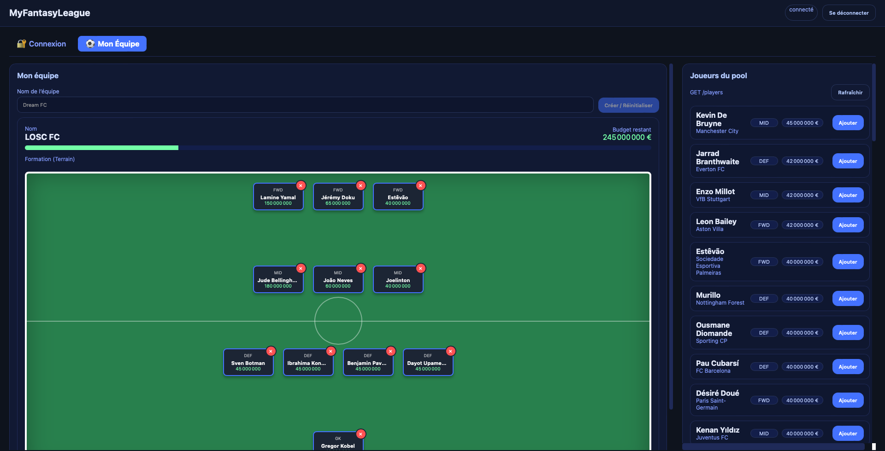

# Projet MyFantasyLeague - Application FullStack Data
### Projet réalisé par Hadrien DEJONGHE & Esteban NABONNE - E5 DSIA



MyFantasyLeague est une application de type _fantasy football_ que nous avons développée en Python avec [FastAPI](https://fastapi.tiangolo.com/), [SQLAlchemy](https://www.sqlalchemy.org/) et [PostgreSQL](https://www.postgresql.org/).  Le projet a été réalisé dans le cadre d'un cours appelé "Application Full Stack Data" enseigné par Monsieur Morgan Courivaud à ESIEE Paris. Ce cours est enseigné en dernière année d'école ingénieur (5ème année) pour l'ensemble de la filière "Data Science & Intelligence Artificelle"

### 📌 Voici en quoi le projet consiste :

C'est une application de Fantasy Football avec interface simple permettant aux utilisateurs de créer une équipe en respectant un budget et en sélectionnant des joueurs.
**MyFantasyLeague** est une application web Full Stack permettant :

- la création d’un compte utilisateur  
- la connexion via un système d’authentification sécurisé (JWT)  
- la création d’une équipe de football (comme bon vous semble)
- la sélection de joueurs tout en respectant un **budget global**  
- la gestion de la composition (ajout / suppression de joueurs)  
- la consultation des joueurs disponibles 

Elle possède :
- un **mode administrateur** permettant la gestion complète du catalogue des joueurs (CRUD)
- des routes d'API sécurisées par un système de rôles (utilisateur simple et administrateur)
- un seed automatique de la base de données avec un administrateur et des joueurs pré‑définis
- une suite de tests automatisés pour valider les principales opérations
- une Dockerisation de l'ensemble de l'application avec un service API et un service base de données
- une gestion centralisée des erreurs HTTP.

Ce projet illustre donc la construction d’une application comprenant backend, base de données, interface graphique simple et tests automatisés, tout en respectant les bonnes pratiques.

## Pourquoi avons-nous choisi ce sujet ?
Nous sommes tous les deux des énormes fans de football. Le système de fantasy league est quelque chose de très répandu dans le monde du sport par équipe et c'est une forme de jeu que l'on connaît bien, on y a énormément joué ensemble. C'est un jeu assez simple et ça permet de débattre sur qui à la meilleur équipe, trouver le meilleur compromis de joueurs avec le budget que l'on a à notre disposition. C'est aussi un jeu très visuel donc plutôt simple à réaliser côté frontend.
Globalement c'était un bon moyen de travailler sur un sujet que l'on aime bien tout en respectant les exigences du projet car cela inclut une gestion totale d'une BDD façon CRUD avec la création d'une équipe, l'ajout ou la suppression de joueurs et la mise à jour du budget. 


---

## 🛠️ Stack technique

| Élément | Technologie |
|--------|-------------|
| Backend | **FastAPI** |
| Base de données | **PostgreSQL** |
| Orchestration | **Docker + docker-compose** |
| Authentification | **JWT (OAuth2 Password Flow)** |
| ORM | SQLAlchemy |
| Validation | Pydantic |
| Tests | pytest + FastAPI TestClient |
| Frontend | HTML / CSS / JavaScript vanilla (page `/ui`) |

---

## Les fonctionnalités principales

### 👤 Gestion des utilisateurs
- Inscription via `/auth/register`
- Connexion via `/auth/login`
- Hash des mots de passe (PassLib)
- Rôle **admin** ou **utilisateur standard**
- Création automatique de :
  - `admin@example.com` (`admin123`)
  - `user@example.com` (`user123`)

### 🔑 Authentification sécurisée
- JSON Web Tokens (JWT)
- Middleware de validation du token
- Dépendances FastAPI pour :
  - `get_current_user`
  - `get_current_active_user`
  - `get_current_admin_user`
- Accès restreint :
  - joueurs CRUD → **admin uniquement**
  - gestion d’équipe → **utilisateur connecté uniquement**

### ⚽ Gestion de l’équipe
Un utilisateur possède **au plus une équipe**, comprenant :

- un **nom**
- une liste de joueurs
- un budget limité (défini par variable d’environnement)

Fonctionnalités :
- créer ou réinitialiser son équipe (`POST /team`)
- ajouter un ou plusieurs joueurs (`POST /team/players`)
- supprimer un joueur (`DELETE /team/players/{player_id}`)
- consulter son équipe (`GET /team`)

### 🧮 Logique métier : budget & validation
- chaque joueur possède un coût
- lors de l’ajout de joueurs :
  - calcul du coût total
  - **exception si dépassement du budget**
- impossibilité d’ajouter deux fois le même joueur
- impossibilité d’ajouter un joueur inexistant

### 📚 Catalogue des joueurs
Routes disponibles :
- `GET /players` → liste paginée
- `GET /players/{id}` → détails
- `POST /players` (admin) → ajout
- `PUT /players/{id}` (admin) → édition
- `DELETE /players/{id}` (admin) → suppression

### 🖥️ Interface web simple
Accessible via :

👉 **http://localhost:8000/ui**

Permet :
- inscription & connexion
- création d’équipe
- sélection des joueurs
- affichage du budget et des joueurs sélectionnés
- retours utilisateurs (messages / toasts)

--- 

## Pour lancer le projet

### Prérequis
- Docker
- docker-compose

1. **Cloner le dépôt** et se placer dans le dossier :

   ```bash
   git clone https://github.com/Hadr1en07/Projet_App_FullStack_Data.git
   cd Projet_App_FullStack_Data
   ```

2. **Démarrer l’application**

```bash
docker-compose up --build
```

Cela démarre deux conteneurs : `web` pour l'API et `db` pour PostgreSQL.  
- L'API est accessible à l'adresse **<http://localhost:8000/ui>**
- Et la documentation interactive (Swagger) est disponible sur <http://localhost:8000/docs>.

À chaque lancement de l’application via Docker :

- les tables sont créées automatiquement
- les utilisateurs admin & user sont ajoutés
- les joueurs sont importés depuis `players_seed.csv`
- une équipe vide est initialisée pour tester facilement


3. **Tester l'API** : consultez la documentation Swagger pour essayer les endpoints.  Utilisez le compte admin (`admin@example.com` / `admin123`) ou créez votre propre utilisateur via l'endpoint `/auth/register`.

### ⚠️ Attention, l'authetification est obligatoire pour lire/créer/modifier une équipe

---

## Tests automatisés

Les tests se trouvent dans `app/tests` et utilisent une base SQLite temporaire.

### Lancer les tests via Docker

```bash
docker-compose exec web pytest app/tests -vv
```
- `test_auth.py` : teste l'inscription, le login, les tokens et les erreurs d’authentification
- `test_players.py` : teste le CRUD des joueurs (routes admin)
- `test_team.py` : teste la création d’équipe, l’ajout de joueurs et le budget

### Détail rapide des tests

- **test_auth.py**
  - Enregistrement d’un utilisateur
  - Connexion correcte
  - Connexion incorrecte → erreur attendue

- **test_players.py**
  - Création d’un admin
  - Création / lecture / mise à jour / suppression d’un joueur
  - Erreur 404 après suppression

- **test_team.py**
  - Création d’une équipe
  - Ajout de joueur(s)
  - Vérification du budget (limité dans les tests)

### Exemple de résultat

```bash
5 passed in X.XXs
```
--> tous les tests doivent passer (les 5 tests des 3 fichiers)
⚠️ Vous verrez sûrement des warnings, ils n'ont aucune importance, cela vient du fait que nous utilisons Pydantic v2 avec du code qui a encore des patterns v1. Ne pas y prêter attention.


---


## ⚠️ Gestion des erreurs HTTP

Le projet inclut une gestion complète des erreurs :

### 🔐 Authentification
| Situation | Erreur HTTP |
|----------|-------------|
| mauvais mot de passe | `400 Bad Request` |
| token invalide / expiré | `401 Unauthorized` |
| utilisateur non admin accédant à une route admin | `403 Forbidden` |

### 🧩 Ressources (Players / Teams)
| Situation | Code |
|----------|------|
| joueur inexistant | `404 Not Found` |
| équipe inexistante | `404 Not Found` |
| suppression d’un joueur qui n’est pas dans l’équipe | `404 Not Found` |

### 💰 Logique métier
| Situation | Erreur |
|----------|--------|
| budget dépassé | `400 Bad Request` |
| ajout d’un joueur déjà présent dans l’équipe | `400 Bad Request` |

### 🔄 Conflits
| Situation | Code |
|----------|------|
| nom d’équipe déjà utilisé | `409 Conflict` |

Toutes les erreurs utilisent `HTTPException` et renvoient un message par le frontend.

--- 


## 🧱 Structure du projet

```
Projet_App_FullStack_Data/
├── app/
│   ├── __init__.py
│   ├── main.py              # Point d'entrée FastAPI
│   ├── database.py          # Création de la connexion et session SQLAlchemy
│   ├── models.py            # Définition des modèles (User, Player, Team, association TeamPlayer)
│   ├── schemas.py           # Schémas Pydantic pour validation et sérialisation
│   ├── auth.py              # Fonctions d'authentification et sécurité JWT
│   ├── crud.py              # Fonctions d'accès aux données
│   ├── dependencies.py      # Dépendances communes (récupération de session, current user…)
│   ├── seed.py              # Script de population de la base au démarrage
│   └── data/
│       └── players_seed.csv    # fichier csv à partir duquel on remplit la BDD au démarrage de l'application
│   └── routers/
│       ├── auth.py          # Routes d'authentification (login, register)
│       ├── players.py       # Routes CRUD pour les joueurs
│       └── team.py          # Routes de gestion de l'équipe de l'utilisateur
│   └──tests/
│       ├── test_auth.py         # Tests d'enregistrement et de connexion
│       ├── test_players.py      # Tests de création et lecture de joueurs
│       └── test_team.py         # Tests de gestion d'équipe et respect du budget
│   └──static/js/
│       └── app.js               # Logique frontend interactive
│   └──templates/
│       └── index.html           # Structure interface utilisateur
├── Dockerfile               # Image de l'application via Docker
├── docker-compose.yml       # Composition des services (API + DB)
├── requirements.txt         # Dépendances Python
├── .gitignore
├── .env.example
├── .env             
└── README.md                
```

--- 

## Choix techniques et difficultés rencontrées

- **FastAPI & SQLAlchemy** : FastAPI est un framework Python que nous avons découvert grâce à ce cours au chapitre 1. FastAPI offre une syntaxe moderne et permet de générer automatiquement une documentation Swagger.  SQLAlchemy a été utilisé pour simplifier l'accès à la base PostgreSQL.
- **JWT & passlib** : l'authentification est basée sur des jetons JWT signés.  Les mots de passe sont hachés avec l'algorithme bcrypt via la bibliothèque Passlib.
- **Gestion du budget** : lors de la création ou mise à jour d'une équipe, l'API vérifie que la somme des coûts des joueurs ne dépasse pas le budget défini dans les variables d'environnement (par défaut 100 000 000).  Un code d'erreur `400` est retourné en cas de dépassement.
- **Tests automatisés** : nous avons mis en place des tests unitaires et d'intégration avec Pytest et HTTPX.  Les tests se lancent contre la base de données dans un environnement isolé, ce qui a nécessité l'utilisation d'une session distincte et la réinitialisation des tables.
- **Docker & docker‑compose** : une des difficultés a été de s'assurer que la base est prête avant d'exécuter la seed ; nous avons utilisé la politique de `depends_on` et un délai dans le script `seed.py`.

--- 

## Pistes d'amélioration

- **Une différente gestion des rôles** : par exemple différencier plus finement les droits (ex. rôle coach, observateur, admin)
- **Validation des postes** : imposer une composition (4 défenseurs, 4 milieux, 2 attaquants…) 
- **Points fantasy** : calculer automatiquement des points en fonction des performances réelles des joueurs (mais cela requiert des données externes) 
- **Recherche des joueurs** : proposer un système de recheche des joueurs par leur nom dans la BDD via l'UI plutôt que de devoir scroller et chercher "à la main"
- **Interface Web** : proposer un front‑end React ou Vue pour rendre l'expérience utilisateur plus agréable. FastAPI est bien mais notre UI pourrait être encore meilleure.

--- 

## ⚠️ Disclaimer

Dans le cadre de ce projet, nous avons utilisé l'IA générative (en l'occurrence **Gemini**) dans le but de :
- nous aider à réaliser la structure du projet
- nous aider à écrire ce README
- nous aider lorsque que nous avions des blocages et des erreurs de code
- nous aider à créer les scripts de test
- nous aider à réaliser le frontend

Nous nous sommes inspirés du cours de M.Courivaud, que vous pouvez retrouver à cette adresse :
<https://github.com/Madwaks/fullstack-data-application>


### Amusez‑vous à créer votre équipe ! 🥅
